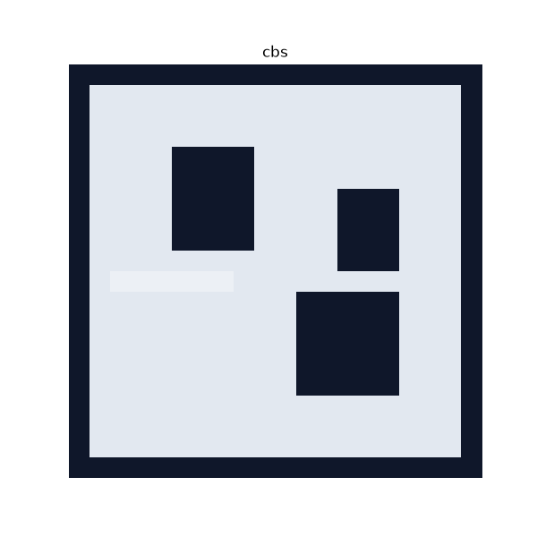
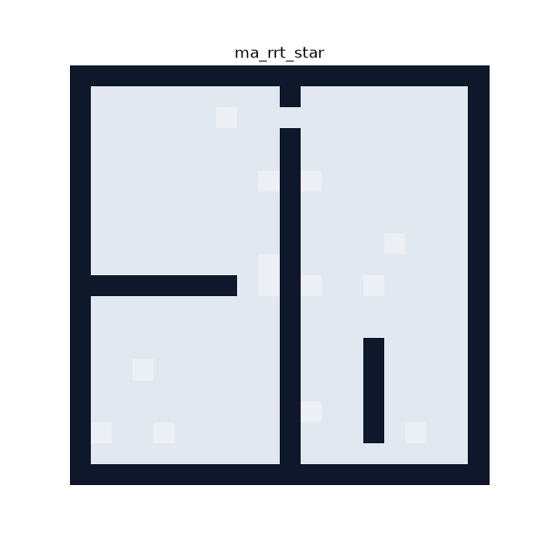
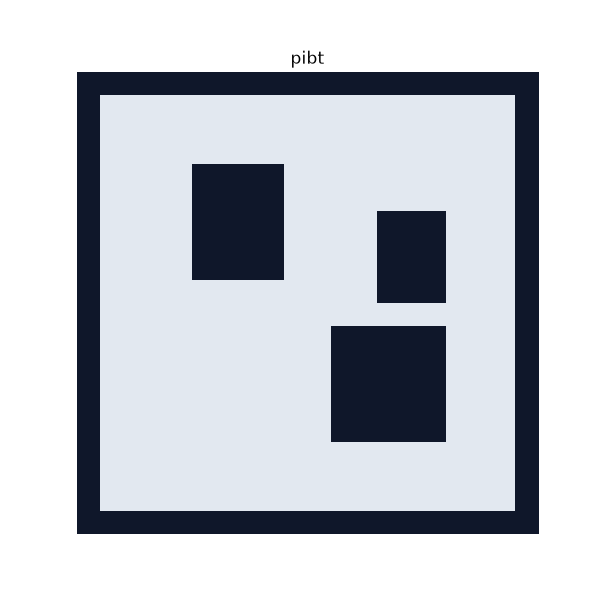
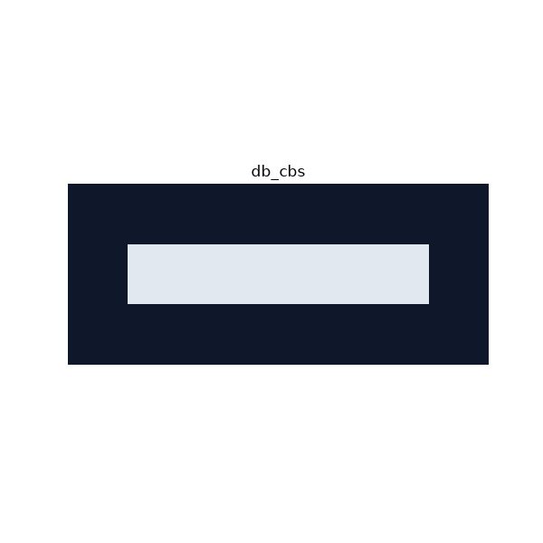

<div align="center">

# 🤖 MRMP · Multi-Agent Motion Planning study

### 🌐 [robotics-study.github.io/mrmp_introduction](https://robotics-study.github.io/mrmp_introduction/)

문서 사이트가 라이브입니다 — 알고리즘마다 유도·증명·라이브 sandbox 페이지. (한국어/English 토글 내장)

**Multi-agent motion planning 의 계보 — search 기반(MAPF), sampling 기반(MRMP), 계획 자체를 버린 decentralized, 계획에 시간을 실어 되돌리는 kinodynamic 갈래까지 C++ / Python 독립 이중 구현으로 스터디**

같은 추상화 설계를 두 언어로 미러링하고, 언어 공용 trace 포맷으로 탐색 과정을 기록하며,<br>
브라우저 라이브 sandbox 로 직접 돌려보고, (scenario × algorithm) 매트릭스로 벤치마크한다.
단일 로봇 navigation 은 자매 저장소<br>
[nav_study](https://github.com/robotics-study/navigation_basic) 에서 다룬다.

*The genealogy of multi-agent motion planning — the search-based branch (MAPF), the
sampling-based branch, the decentralized branch that drops the plan itself, and the kinodynamic
branch that hands the plan back with a clock attached — mirrored in
C++20 and Python, with step-by-step visualization, live
in-browser sandboxes running the same engines, and a benchmark matrix. Single-robot navigation
lives in the sibling nav_study repo.*


| CBS (2015) | MA-RRT* (2013) | PIBT (2022) | db-CBS (2023) |
|:---:|:---:|:---:|:---:|
|  |  |  |  |

*네 갈래의 대표 시연 하나씩 — search · sampling · decentralized · kinodynamic. 에이전트마다 고유 색,
빨간 ✕ 는 선택된 충돌, 점선은 그 제약; 탐색 축적과 실행 재생 모두 시간 순서대로 흐른다.*

</div>

---

## ✨ 특징

- **📐 공통 추상화** — 모든 planner 는 `MultiAgentPlanner` 를 상속하고, 구체 맵이 아닌 **capability 인터페이스**(`DiscreteSpace`: 4-connected 이동 + wait, Manhattan heuristic)만 요구한다. 새 맵 타입을 추가해도 알고리즘 코드는 바뀌지 않는다.
- **🪞 언어 미러링** — C++ 과 Python 이 같은 설계·같은 파라미터·같은 trace 이벤트를 각자 idiomatic 하게 구현한다. 공유 계약(`spec/`)·파라미터(`configs/`)·맵(`maps/`)은 언어 밖에 두고 양쪽에서 로드한다.
- **🎬 Trace 기반 시각화** — 알고리즘은 탐색 진행을 JSON Lines 이벤트로 방출하고, 재생기는 언어당 하나가 아니라 **하나**(`tools/viz/replay.py`)다. GIF 애니메이션 + 중간 과정 PNG 스냅샷을 만든다.
- **📊 벤치마크 매트릭스** — `tools/bench/run_matrix.py` 가 (scenario × algorithm) 전 조합을 실행해 성공 여부·sum_of_costs·makespan·expanded_nodes 를 수집하고 리포트를 쓴다.
- **🌐 인터랙티브 문서 사이트** — 알고리즘마다 유도·성질·증명·라이브 sandbox(벽을 그리고 endpoint 를 끌어 편집하면 브라우저 엔진이 즉시 재계획)·실제 구현 소스를 한 페이지에 담는다. 브라우저 엔진은 planner 의 세 번째 미러이며, 저장소가 수출한 trace 는 parity 검증의 기준 자료로만 쓰인다.

## 📚 문서 사이트

**[📖 robotics-study.github.io/mrmp_introduction](https://robotics-study.github.io/mrmp_introduction/)** — 우상단 토글로 한국어/English 전환.

알고리즘별 페이지: 개념 유도 + 성질(완전성·최적성·복잡도) 증명 + pseudocode 해설 +
라이브 sandbox 데모(편집하면 즉시 재계획) + 실제 C++/Python 소스 + **원 논문 레퍼런스(DOI)**.

|  |  |  |
|---|---|---|
| [Prioritized A*](https://robotics-study.github.io/mrmp_introduction/algo/prioritized_astar) — Erdmann & Lozano-Pérez 1987 | [Push and Swap](https://robotics-study.github.io/mrmp_introduction/algo/push_and_swap) — Luna & Bekris 2011 | [Push and Rotate](https://robotics-study.github.io/mrmp_introduction/algo/push_and_rotate) — de Wilde et al. 2014 |
| [Joint-Space A*](https://robotics-study.github.io/mrmp_introduction/algo/joint_astar) — 관행적 baseline | [CBS](https://robotics-study.github.io/mrmp_introduction/algo/cbs) — Sharon et al. 2015 | [RHCR](https://robotics-study.github.io/mrmp_introduction/algo/rhcr) — Li et al. 2021 |
| [MA-RRT*](https://robotics-study.github.io/mrmp_introduction/algo/ma_rrt_star) — Čáp et al. 2013 | [sRRT](https://robotics-study.github.io/mrmp_introduction/algo/subdimensional_rrt) — Wagner et al. 2012 | [dRRT](https://robotics-study.github.io/mrmp_introduction/algo/drrt) — Solovey et al. 2016 |
| [dRRT*](https://robotics-study.github.io/mrmp_introduction/algo/drrt_star) — Shome et al. 2020 | [PIBT](https://robotics-study.github.io/mrmp_introduction/algo/pibt) — Okumura et al. 2022 | [winPIBT](https://robotics-study.github.io/mrmp_introduction/algo/winpibt) — Okumura et al. 2020 |
| [MAPF-POST](https://robotics-study.github.io/mrmp_introduction/algo/mapf_post) — Hönig et al. 2016 | [db-CBS](https://robotics-study.github.io/mrmp_introduction/algo/db_cbs) — Moldagalieva et al. 2023 | |

> 사이트 소스는 `document/` (React + Vite SPA). `main` 에 push 되면 GitHub Actions 가
> 빌드해 GitHub Pages 로 배포한다 (`.github/workflows/deploy.yml`).
>
> ```bash
> cd document && yarn install && yarn dev    # 로컬 개발 서버
> yarn build                                 # 배포 번들 (prerender + sitemap 포함)
> node scripts/check-engine-parity.mjs       # 브라우저 데모 엔진 ↔ python trace parity 검증
> ```

## 🗺️ 구현 현황 (parity)

| 섹션 | 알고리즘 | C++ | Python | 원 논문 |
|---|---|:---:|:---:|---|
| search | Prioritized A* | ✅ | ✅ | Erdmann & Lozano-Pérez (1987) |
| search | Push and Swap | ✅ | ✅ | Luna & Bekris (IJCAI 2011) |
| search | Push and Rotate | ✅ | ✅ | de Wilde, ter Mors & Witteveen (JAIR 2014) |
| search | Joint-space A* | ✅ | ✅ | joint-state search (관행적 baseline) |
| search | CBS | ✅ | ✅ | Sharon, Stern, Felner & Sturtevant (2015) |
| search | RHCR | ✅ | ✅ | Li, Tinka, Kiesel, Durham, Kumar & Koenig (AAAI-21, arXiv:2005.07371) |
| sampling | MA-RRT* | ✅ | ✅ | Čáp, Novák, Vokřínek & Pěchouček (2013) |
| sampling | sRRT | ✅ | ✅ | Wagner, Kang & Choset (2012) |
| sampling | dRRT | ✅ | ✅ | Solovey, Salzman & Halperin (2016) |
| sampling | dRRT* | ✅ | ✅ | Shome, Solovey, Dobson, Halperin & Bekris (Autonomous Robots 2020) |
| decentralized | PIBT | ✅ | ✅ | Okumura, Machida, Défago & Tamura (Artificial Intelligence 310, 2022; IJCAI 2019) |
| decentralized | winPIBT | ✅ | ✅ | Okumura, Tamura & Défago (IJCAI-20 MAPF workshop, arXiv:1905.10149) |
| kinodynamic | MAPF-POST | ✅ | ✅ | Hönig, Kumar, Cohen, Ma, Xu, Ayanian & Koenig (ICAPS 2016) |
| kinodynamic | db-CBS | ✅ | ✅ | Moldagalieva, Ortiz-Haro, Toussaint & Hönig (arXiv:2309.16445) |

네 갈래는 계보 순서대로 도착했다 — search(계획을 열거로 세운다) → sampling(계획을 표본으로 세운다) → decentralized(계획이라는 매개체 자체를 버린다) → kinodynamic(계획에 시간 — 속도 한계와 dwell semantics — 을 실어 되돌린다). 각 갈래 안에서 계보순(decoupled/priority → coupled → hybrid; priority 갈래의 decentralized 계열은 Push and Swap과 Push and Rotate로 완성)으로 wave 단위로 구현. ✅ done 이 되면 각 알고리즘 페이지의 References 에 원 논문 링크가 붙는다. Push and Swap 은 예약을 동결하지 않고 push/swap primitive 로 끝난 agent 를 치운다 — 파라미터 무의존이고, swap 자리는 격자에서 빈 2×2 block 뿐이라 폭 1 통로는 정직하게 실패한다. Push and Rotate 는 그 자유 그래프를 biconnected subgraph 와 plank 으로 분해하고 맞교환을 degree-3 junction 의 rotate 로 확장해, 해가 있을 때 항상 찾고 없으면 불가능하다고 보고하는 판정 절차가 된다. sampling 갈래의 첫 회원 MA-RRT* 는 논문 자체의 이산화(G-RRT*)로 DiscreteSpace 위에서 구현됐으므로 새 맵 타입 없이 들어왔고, sRRT 도 개별 policy 가 격자에서 BFS tree 로 정확히 구성되므로 같은 DiscreteSpace 위에 들어왔다. dRRT 는 연속 configuration space 용 새 capability ContinuousSpace 위에서 구현됐다. 같은 raster 를 그대로 쓰되 robot 을 반지름 있는 disc 로 다루고, 부풀려진 obstacle 은 쓰지 않는다. dRRT* 는 같은 ContinuousSpace 위의 informed asymptotically-optimal 후속 — 개별 roadmap 이 k-nearest 에서 PRM* connection radius 로, tree 탐색이 oracle growth + decoupled connector 에서 cost-to-come rewiring + branch-and-bound 로 바뀐다. 세 번째 갈래의 첫 회원 PIBT 는 계획이라는 매개체를 통째로 버린다 — 오프라인 경로 없이 매 스텝 우선순위 상속으로 다음 칸을 협상하고(Okumura et al.), search 갈래가 primitive 로 수리했던 폭 1 통로를 정직한 교착으로 남긴다. 같은 저자들의 후속 winPIBT 는 그 협상에 시간 창을 달아 축을 만든다 — w=1 은 PIBT 를 그대로 재현하고, 창이 커지면 계획이 조금씩 돌아와 prioritized planning 으로 연속 퇴화한다. 네 번째 갈래 kinodynamic 의 MAPF-POST 는 계획을 되돌려 받는다 — CBS 가 조용히 푼 충돌 없는 이산 계획을 Temporal Plan Graph 로 바꾸고, 모든 공유 셀을 안전 마커 사이의 precedence 로 바꿔 항상 acyclic 한 STN 에서 가장 빠른 실행 스케줄로 낸다. agent 는 출발 시각까지 머물고 자기 속도 한계로 이동한다. search 갈래의 다섯 번째 회원 RHCR 은 그 hybrid 극단을 시간축 자체로 접는다 — 창 달린 CBS 를 실제 위치에서 h 스텝마다 다시 굴리고 창 안의 도착 스텝만 해소한다(Li, Tinka, Kiesel, Durham, Kumar & Koenig, AAAI-21). w=∞ 에서 정확히 CBS 이고, 창을 좁히면 근시안 자체가 연구 대상이 된다 — pliable, 결코 얼리지 않음, 판정 모드조차 없음. kinodynamic 갈래의 두 번째 회원 db-CBS 는 계보를 한 칸 더 접는다 — 계획 위에 시간을 얹는 대신 운동 자체를 탐색으로 옮긴다: CBS 의 저수준이 (cell, velocity) 상태(정수 속도 격자, 축별 가속 1칸/스텝²의 정확한 이중 적분자) 위 A*가 되고, 제약은 부피(Manhattan floor(δ))가 되고, swap 은 더 이상 충돌이 아니다. 바깥 루프는 불연속성 경계를 칸마다([1.5 → 0.5]) 조이고 성공한 마지막 칸의 해가 답이다 — δ < 1 에서 관성은 법이고, search 가 정직하게 실패하던 폭 1 통로가 solvable 이 된다. 단일 로컬 planner(VO/RVO/ORCA 등)는 자매 저장소 nav_study 의 local_planning 범위.

## 🚀 빠른 시작

```bash
# Python (>= 3.10) — mrmp 패키지 + viz/dev extras
cd python && pip install -e ".[dev,viz]" && cd ..
PYTHONPATH=$PWD/python .venv/bin/python -m pytest python/tests -q   # 200 passed

# C++ (C++20, CMake >= 3.20, GoogleTest 는 FetchContent 자동)
cmake -S cpp -B cpp/build -DCMAKE_BUILD_TYPE=Release
cmake --build cpp/build -j
ctest --test-dir cpp/build     # 193 tests
```

### 데모 실행 — 두 언어가 동일한 CLI 인자 (알고리즘 구현 시 활성화)

```bash
# Python
python python/demos/demo_prioritized_astar.py \
  --map maps/grid/maze01.yaml --scenario maps/scenarios/maze01_two.yaml \
  --params configs/search/prioritized_astar.yaml --trace out/trace.jsonl

# C++ (동일 인자)
./cpp/build/demos/demo_prioritized_astar \
  --map maps/grid/maze01.yaml --scenario maps/scenarios/maze01_two.yaml \
  --params configs/search/prioritized_astar.yaml --trace out/trace.cpp.jsonl
```

stdout 에 한 줄 JSON metric(`sum_of_costs`·`makespan`·`expanded_nodes`), `--trace` 경로에 step-by-step JSONL trace 가 남는다.

### 시각화 — C++/Python trace 를 같은 도구로 재생

```bash
python tools/viz/replay.py out/trace.jsonl                    # interactive 재생
python tools/viz/replay.py out/trace.jsonl --gif out/x.gif --snapshots out/snaps/
```

### 벤치마크

```bash
python tools/bench/run_matrix.py --out out/report.md
```

## 📁 저장소 구조

```
├── spec/          # 언어 공용 계약 — trace/param 스키마, 맵 포맷 (single source of truth)
├── maps/          # 벤치마크 grid 맵 (pgm/yaml) + agents(start/goal) 시나리오
├── configs/       # 알고리즘별 파라미터 yaml — C++/Python 이 같은 파일을 읽는다
├── cpp/           # C++20 구현 (include + src + demos + GoogleTest)
├── python/        # Python 구현 (mrmp 패키지 + demos + pytest)
├── tools/         # viz(trace 재생기) · bench(매트릭스 러너) · web_export(사이트 맵 + parity trace 수출)
└── document/      # 문서 사이트 (React + Vite SPA → GitHub Pages)
```

아키텍처 원칙(의존 방향, capability 모델, trace 계약)은 [CLAUDE.md](CLAUDE.md) 참고.

## 🧭 새 알고리즘 추가

1. `configs/<section>/<algo>.yaml` 파라미터 선언 → 2. 두 언어 구현 (`required_capabilities()` 포함)
→ 3. trace 이벤트 방출 → 4. 두 언어 demo → 5. 단위 테스트 (최적성/충돌 없음/no-path/param 검증)
→ 6. bench 매트릭스 통과 → 7. `replay.py --gif/--snapshots` 렌더 확인 → 8. parity 표 + 문서 사이트 페이지 갱신.

상세 체크리스트는 [CLAUDE.md](CLAUDE.md) 참고.
